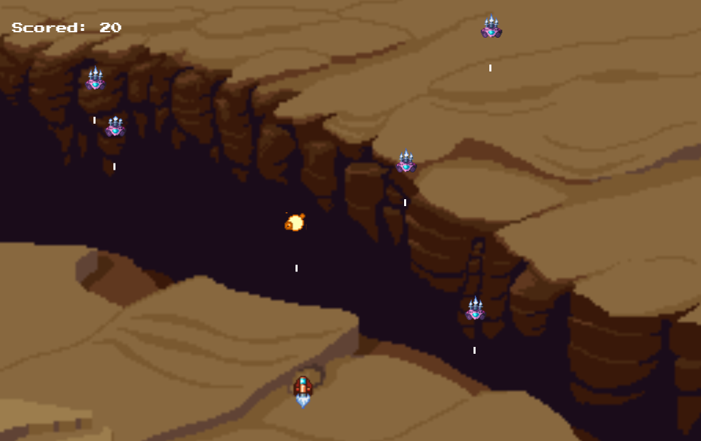
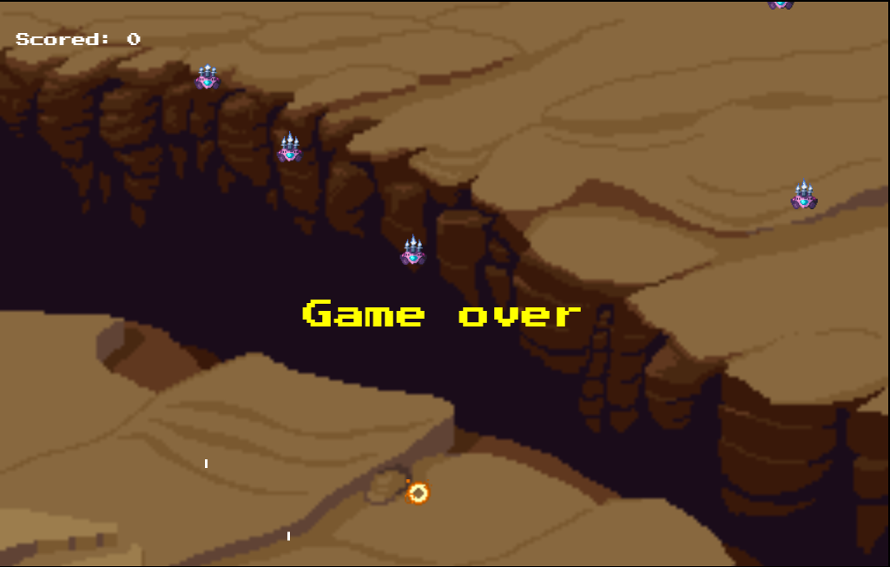

# Game Space Invader With Javascript, Html5 And Css3

> ## Purpose
***I made this game for learning purpose. Based on this project I can understand more about javascript canvas, DOM, class and Object,etc... This is a pretty simple game based on Tomohiro Nishikado's space invaders game.***

> ## Description
***Space Invaders is a Japanese shooting video game released in 1978 by Taito. It was developed by Tomohiro Nishikado, who was inspired by other media: Breakout, The War of the Worlds, and Star Wars.***
> ## Screenshot

